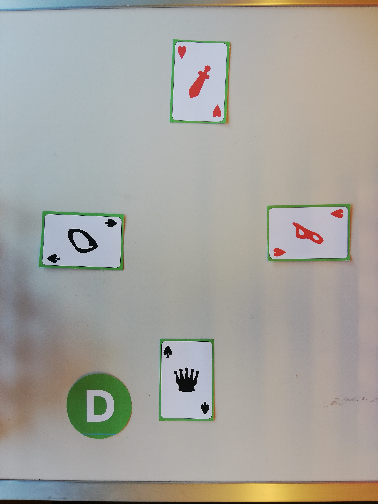
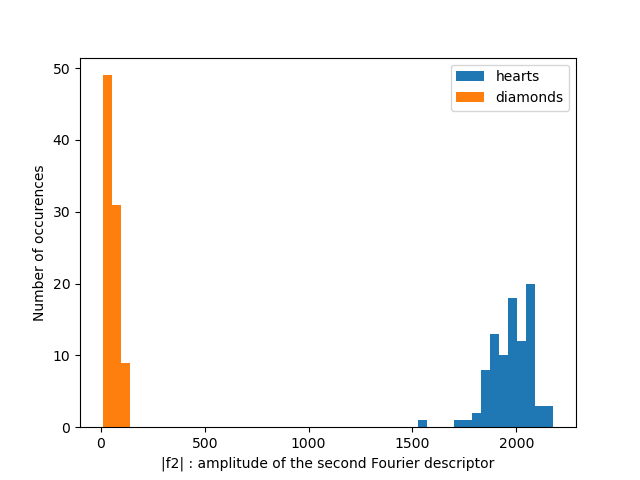
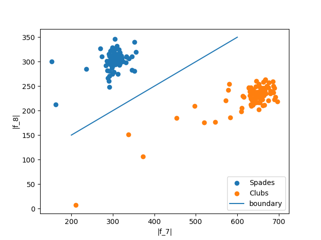

# card-game-vision

🚧 Work in Progress : this project is in the process of being "revived"

## Overview

This work was completed in **2021** as a graded project for the EPFL Image Analysis and Pattern Recognition course, taught by Prof. Jean-Philippe Thiran. The final grade was **6/6**.

In short, the goal is to predict the outcome of a new unseen card game, given noisy pictures of the rounds of several card games (with handwritten digits) as a training set. One such picture is displayed below. A detailed description of the project and its requirements is given at `\docs\project_requirements.md`

## Our solution
### Segmentation
The first step is segmentation, i.e. the process of partitioning a digital image into multiple image segments. Here, we want to segment each card on the table, plus the dealer sign. Within each card, we extract the digit/figure, and the suite. This process is performed with classical image analysis techniques, levaraging the fact that the cards have a green border and the dealer sign is also green. The techniques we use are: gamma correction, convertion to a binary image using a green filter, dilation, contour detection and convex hull extraction. The longest 5 contours that are detected in each image represent the four cards and the dealer sign; these can be separated by looking at the ratio between the area of the contour and area of the largest circle enclosed within the contour. Then, for each card, we apply Otsu's method to convert to binary image, and again extract the contours and classify them with appropriate features between digits/figures and suits.

### Feature Extraction and Classification

Once the digits/figures and suits have been extracted (and assigned to a player), we can classify them.

#### Suits classiffication.

##### Approach 1: [Fourier descriptors](https://demonstrations.wolfram.com/FourierDescriptors/) ✅
In our first approach, we use color detection to distinguish between spades/clubs (black) and hearts/diamonds (red). Then, for each group, we choose proper Fourier descriptors. We notice that the amplitude of the second Fourier descriptor is sufficient to classify heart and diamonds, while the 7th and 8th descriptors work great for spades and clubs.

##### Approach 2: Data augmentation and neural network ✅
In our second approach, we use random dilation/erosion and rotation to augment our dataset of extracted suit images, and train a neural network with TensorFLow. The trained model is saved under `/trained_models/modelS` under SavedModel format. Both approaches yeald excellent result, although the first is definetely more elegant.

#### Digits and figure classification
To properly classify digits, it was important to make use of the MNIST dataset, as the digits from the training set would not be the same as the one of the testing set.

##### Approach 1: Single neural network ❌
The idea is to have a single neural network for both figures and digits. The neural network (`/trained_models/modelFD`) was trained on the MNIST dataset and on the segmented training figures set, which was augmented. Although we mimicked the preprocessing of the MNIST data set, achieving a format that looked almost identical to the MNIST, the NN must have learned to pick up on that very small difference in preprocessing. In fact, it has a very good performance on the MNIST testing set (>0.95) and on the figures (=1), but a very bad performance on the segmented digits, which are confused with figures.

##### Approach 2: Fourier descriptors and gaussian model for the figures (J, Q, K), and a neural network for the digits ✅
Our final approach is to combine the Fourier descriptors, used to identify the figures, and a Neural Network (model_9527) trained on the MNIST dataset to identify the digits. Hence, classification is performed in two steps: first, the Fourier descriptors are computed, and belonging to a figure class is tested with a Gaussian model. Second, if the sample is not a figure, it is processed by the neural network and classified as a digit.

## Repository structure

